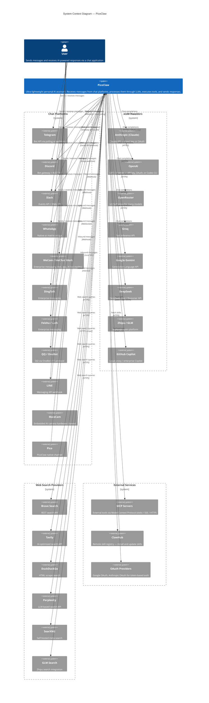

# C4 Level 1 — System Context

PicoClaw as a black box. Shows the humans and external systems it interacts with.

```mermaid
C4Context
  title System Context Diagram — PicoClaw

  Person(user, "User", "Sends messages and receives AI-powered responses via a chat application")

  System(picoclaw, "PicoClaw", "Ultra-lightweight personal AI assistant. Receives messages from chat platforms, processes them through LLMs, executes tools, and sends responses.")

  Boundary(chat_boundary, "Chat Platforms") {
    System_Ext(telegram, "Telegram", "Bot API via polling or webhook")
    System_Ext(discord, "Discord", "Bot gateway + REST API")
    System_Ext(slack, "Slack", "Events API + Web API")
    System_Ext(whatsapp, "WhatsApp", "Native or matrix-bridge")
    System_Ext(wecom, "WeCom / WeChat Work", "Enterprise messaging (bot, app, AI bot modes)")
    System_Ext(dingtalk, "DingTalk", "Enterprise messaging")
    System_Ext(feishu, "Feishu / Lark", "Enterprise messaging")
    System_Ext(onebot, "QQ / OneBot", "QQ via OneBot v11 protocol")
    System_Ext(line, "LINE", "Messaging API webhook")
    System_Ext(maixcam, "MaixCam", "Embedded AI camera hardware channel")
    System_Ext(pico, "Pico", "PicoClaw native channel")
  }

  Boundary(llm_boundary, "LLM Providers") {
    System_Ext(anthropic, "Anthropic (Claude)", "Claude API — direct key or OAuth")
    System_Ext(openai, "OpenAI", "GPT / o-series — API key, OAuth, or Codex CLI")
    System_Ext(openrouter, "OpenRouter", "Unified proxy for many models")
    System_Ext(groq, "Groq", "Fast inference API")
    System_Ext(gemini, "Google Gemini", "Generative Language API")
    System_Ext(deepseek, "DeepSeek", "DeepSeek Chat / Reasoner API")
    System_Ext(zhipu, "Zhipu / GLM", "BigModel open platform")
    System_Ext(copilot, "GitHub Copilot", "Local proxy / enterprise Copilot")
  }

  Boundary(search_boundary, "Web Search Providers") {
    System_Ext(brave, "Brave Search", "REST search API")
    System_Ext(tavily, "Tavily", "AI-optimised search API")
    System_Ext(duckduckgo, "DuckDuckGo", "HTML scrape search")
    System_Ext(perplexity, "Perplexity", "LLM-based search API")
    System_Ext(searxng, "SearXNG", "Self-hosted meta-search")
    System_Ext(glmsearch, "GLM Search", "Zhipu search integration")
  }

  Boundary(ext_boundary, "External Services") {
    System_Ext(mcp, "MCP Servers", "External tools via Model Context Protocol (stdio / SSE / HTTP)")
    System_Ext(clawhub, "ClawHub", "Remote skill registry — install and update skills")
    System_Ext(oauth, "OAuth Providers", "Google OAuth, Anthropic OAuth for token-based auth")
  }

  %% User → platform → PicoClaw
  Rel(user, telegram,  "Sends / receives messages")
  Rel(user, discord,   "Sends / receives messages")
  Rel(user, slack,     "Sends / receives messages")
  Rel(user, whatsapp,  "Sends / receives messages")
  Rel(user, wecom,     "Sends / receives messages")
  Rel(user, dingtalk,  "Sends / receives messages")
  Rel(user, feishu,    "Sends / receives messages")
  Rel(user, onebot,    "Sends / receives messages")
  Rel(user, line,      "Sends / receives messages")

  Rel(telegram, picoclaw, "Inbound messages",  "Webhook / long-polling")
  Rel(discord,  picoclaw, "Inbound messages",  "Gateway websocket")
  Rel(slack,    picoclaw, "Inbound messages",  "Events API webhook")
  Rel(whatsapp, picoclaw, "Inbound messages",  "Bridge webhook")
  Rel(wecom,    picoclaw, "Inbound messages",  "Webhook")
  Rel(dingtalk, picoclaw, "Inbound messages",  "Webhook")
  Rel(feishu,   picoclaw, "Inbound messages",  "Webhook")
  Rel(onebot,   picoclaw, "Inbound messages",  "WebSocket")
  Rel(line,     picoclaw, "Inbound messages",  "Webhook")
  Rel(maixcam,  picoclaw, "Inbound messages",  "Local IPC")
  Rel(pico,     picoclaw, "Inbound messages",  "Internal")

  Rel(picoclaw, telegram, "Outbound responses")
  Rel(picoclaw, discord,  "Outbound responses")
  Rel(picoclaw, slack,    "Outbound responses")

  %% PicoClaw → LLMs
  Rel(picoclaw, anthropic,  "Chat completions",  "HTTPS / OAuth")
  Rel(picoclaw, openai,     "Chat completions",  "HTTPS / OAuth / CLI")
  Rel(picoclaw, openrouter, "Chat completions",  "HTTPS")
  Rel(picoclaw, groq,       "Chat completions",  "HTTPS")
  Rel(picoclaw, gemini,     "Chat completions",  "HTTPS")
  Rel(picoclaw, deepseek,   "Chat completions",  "HTTPS")
  Rel(picoclaw, zhipu,      "Chat completions",  "HTTPS")
  Rel(picoclaw, copilot,    "Chat completions",  "Local proxy")

  %% PicoClaw → search
  Rel(picoclaw, brave,      "Web search queries", "HTTPS")
  Rel(picoclaw, tavily,     "Web search queries", "HTTPS")
  Rel(picoclaw, duckduckgo, "Web search queries", "HTTPS scrape")
  Rel(picoclaw, perplexity, "Web search queries", "HTTPS")
  Rel(picoclaw, searxng,    "Web search queries", "HTTPS")
  Rel(picoclaw, glmsearch,  "Web search queries", "HTTPS")

  %% External tools / skills
  Rel(picoclaw, mcp,      "Tool calls",       "stdio / SSE / HTTP")
  Rel(picoclaw, clawhub,  "Fetch skills",     "HTTPS")
  Rel(picoclaw, oauth,    "Authenticate",     "OAuth 2.0")

  UpdateLayoutConfig($c4ShapeInRow="4", $c4BoundaryInRow="2")
```
