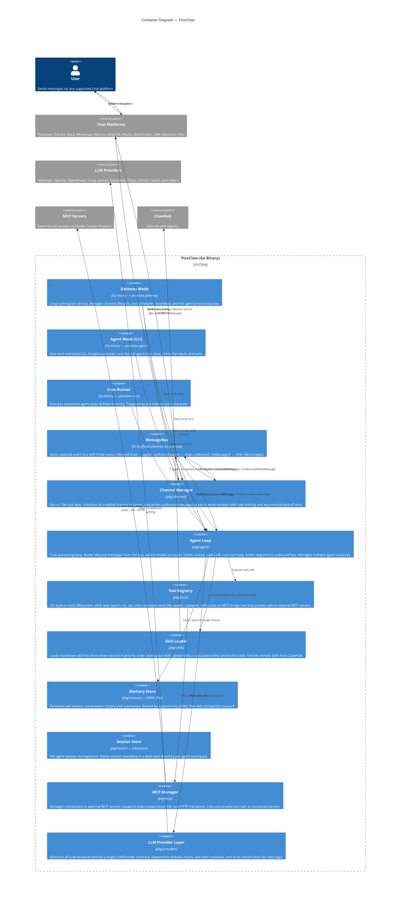

# C4 Level 2 — Containers

Major deployable units and in-process runtimes inside PicoClaw.

```mermaid
C4Container
  title Container Diagram — PicoClaw

  Person(user, "User", "Sends messages via any supported chat platform")

  System_Ext(chat_platforms, "Chat Platforms", "Telegram, Discord, Slack, WhatsApp, WeCom, DingTalk, Feishu, QQ/OneBot, LINE, MaixCam, Pico")
  System_Ext(llm_providers,  "LLM Providers",  "Anthropic, OpenAI, OpenRouter, Groq, Gemini, DeepSeek, Zhipu, GitHub Copilot, and others")
  System_Ext(mcp_servers,    "MCP Servers",    "External tool servers via Model Context Protocol")
  System_Ext(clawhub,        "ClawHub",        "Remote skill registry")

  System_Boundary(picoclaw, "PicoClaw (Go Binary)") {

    Container(gateway, "Gateway Mode", "Go binary — picoclaw gateway", "Long-running bot service. Manages channel lifecycle, cron scheduler, heartbeat, and the agent processing loop.")

    Container(agent_cli, "Agent Mode (CLI)", "Go binary — picoclaw agent", "One-shot interactive CLI. Accepts a prompt, runs the full agent loop once, prints the result, and exits.")

    Container(cron_runner, "Cron Runner", "Go binary — picoclaw cron", "Executes scheduled agent tasks defined in config. Triggered by the internal cron scheduler.")

    Container(message_bus, "MessageBus", "Go buffered channels (in-process)", "Async pub/sub event bus with three topics: inbound (chat → agent), outbound (agent → chat), outbound_media (agent → chat, files/images).")

    Container(channel_manager, "Channel Manager", "pkg/channels", "Fan-in / fan-out layer. Initialises all enabled channel adapters, dispatches outbound messages to per-channel workers with rate limiting and exponential-backoff retry.")

    Container(agent_loop, "Agent Loop", "pkg/agent", "Core processing loop. Reads inbound messages from the bus, selects model via router, builds context, calls LLM, runs tool loop, writes response to outbound bus. Manages multiple agent instances.")

    Container(tool_registry, "Tool Registry", "pkg/tools", "25+ built-in tools (filesystem, shell, web search, i2c, spi, cron, message, send_file, spawn, subagent, skills) plus an MCP bridge tool that proxies calls to external MCP servers.")

    Container(skill_loader, "Skill Loader", "pkg/skills", "Loads markdown skill files from three sources in priority order: workspace skills, global skills (~/.picoclaw/skills), and builtin skills. Fetches remote skills from ClawHub.")

    Container(memory_store, "Memory Store", "pkg/memory — JSONL files", "Persistent per-session conversation history and summaries. Backed by append-only JSONL files with compaction support.")

    Container(session_db, "Session Store", "pkg/session — filesystem", "Per-agent session management. Stores session metadata in a dedicated directory per agent workspace.")

    Container(mcp_manager, "MCP Manager", "pkg/mcp", "Manages connections to external MCP servers. Supports stdio (subprocess), SSE, and HTTP transports. Lists and proxies tool calls to connected servers.")

    Container(provider_layer, "LLM Provider Layer", "pkg/providers", "Abstracts all LLM backends behind a single LLMProvider interface. Implements fallback chains, rate-limit cooldown, and error classification for retry logic.")
  }

  %% User flow through chat platforms
  Rel(user,           chat_platforms,  "Sends messages")
  Rel(chat_platforms, channel_manager, "Webhook / polling inbound events", "HTTP / WebSocket")
  Rel(channel_manager, message_bus,   "Publishes InboundMessage")
  Rel(message_bus,    agent_loop,     "Consumes InboundMessage")

  %% Agent loop internals
  Rel(agent_loop,     memory_store,    "Load / save message history")
  Rel(agent_loop,     skill_loader,    "Load skill content for system prompt")
  Rel(agent_loop,     tool_registry,   "Execute tool calls")
  Rel(agent_loop,     provider_layer,  "Chat completion requests")
  Rel(agent_loop,     message_bus,     "Publishes OutboundMessage / OutboundMediaMessage")

  %% Tool and MCP
  Rel(tool_registry,  mcp_manager,     "Proxy MCP tool calls")
  Rel(mcp_manager,    mcp_servers,     "Tool invocations", "stdio / SSE / HTTP")

  %% Outbound path
  Rel(message_bus,    channel_manager, "Consumes OutboundMessage / OutboundMediaMessage")
  Rel(channel_manager, chat_platforms, "Sends responses", "Bot API / REST")
  Rel(chat_platforms, user,            "Delivers responses")

  %% External connections
  Rel(provider_layer, llm_providers,   "Chat completions", "HTTPS")
  Rel(skill_loader,   clawhub,         "Fetch remote skills", "HTTPS")

  %% Modes
  Rel(gateway,    channel_manager, "Owns and starts")
  Rel(gateway,    agent_loop,      "Owns and runs")
  Rel(agent_cli,  agent_loop,      "Runs single turn")
  Rel(cron_runner, agent_loop,     "Triggers scheduled tasks")

  UpdateLayoutConfig($c4ShapeInRow="3", $c4BoundaryInRow="1")
```
