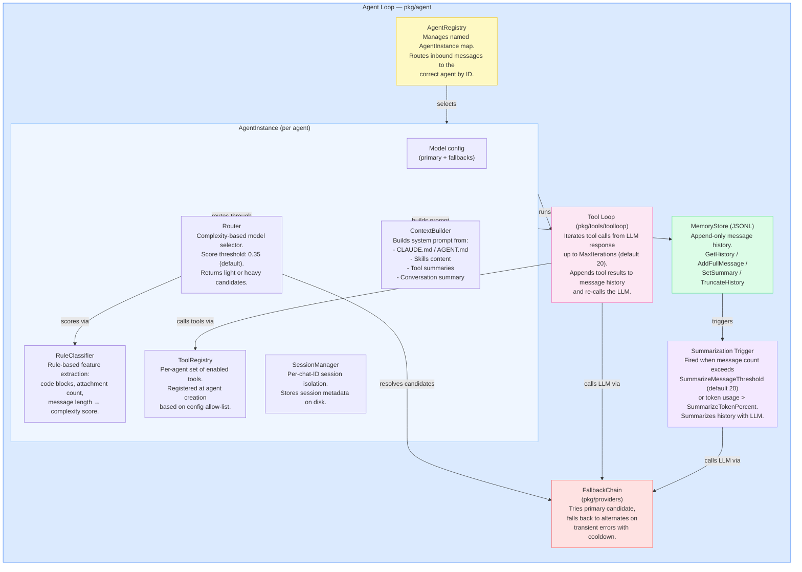
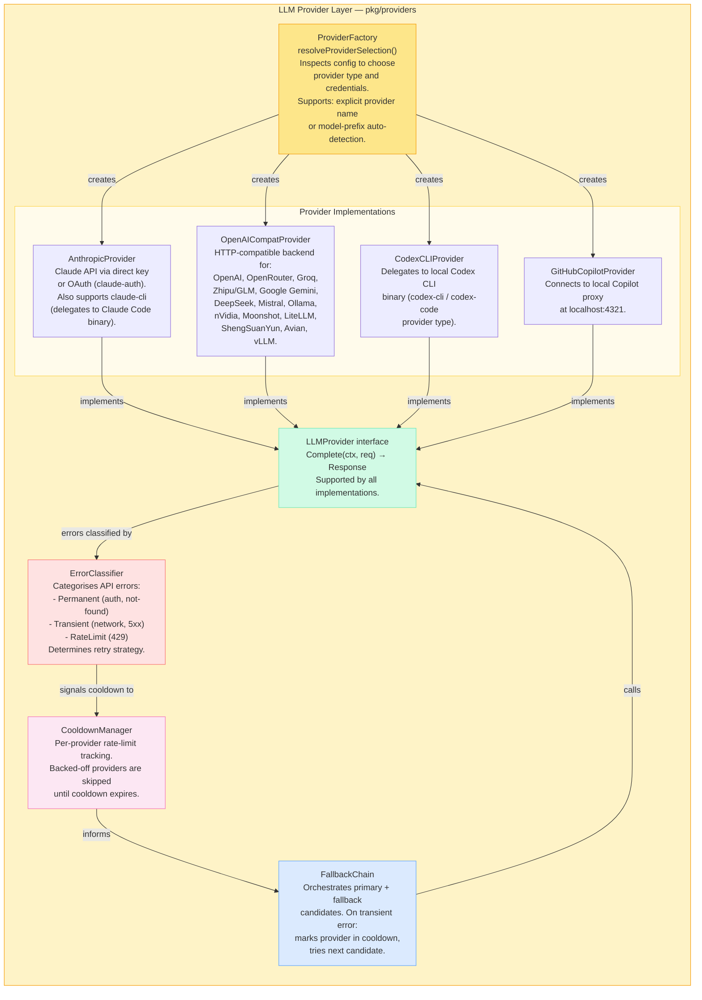

# C4 Level 3 — Components

Internal structure of the two most important containers.

---

## Diagram A — Agent Loop (`pkg/agent`)

```mermaid
graph TD
  subgraph AgentLoop["Agent Loop — pkg/agent"]
    direction TB

    Registry["AgentRegistry\nManages named AgentInstance map.\nRoutes inbound messages to the\ncorrect agent by ID."]

    subgraph Instance["AgentInstance (per agent)"]
      direction TB
      Model["Model config\n(primary + fallbacks)"]
      Router["Router\nComplexity-based model selector.\nScore threshold: 0.35 (default).\nReturns light or heavy candidates."]
      Classifier["RuleClassifier\nRule-based feature extraction:\ncode blocks, attachment count,\nmessage length → complexity score."]
      ContextBuilder["ContextBuilder\nBuilds system prompt from:\n- CLAUDE.md / AGENT.md\n- Skills content\n- Tool summaries\n- Conversation summary"]
      ToolsReg["ToolRegistry\nPer-agent set of enabled tools.\nRegistered at agent creation\nbased on config allow-list."]
      Sessions["SessionManager\nPer-chat-ID session isolation.\nStores session metadata on disk."]
    end

    MemoryStore["MemoryStore (JSONL)\nAppend-only message history.\nGetHistory / AddFullMessage /\nSetSummary / TruncateHistory"]

    ToolLoop["Tool Loop (pkg/tools/toolloop)\nIterates tool calls from LLM response\nup to MaxIterations (default 20).\nAppends tool results to message history\nand re-calls the LLM."]

    FallbackChain["FallbackChain\n(pkg/providers)\nTries primary candidate,\nfalls back to alternates on\ntransient errors with cooldown."]

    SummarizeTrigger["Summarization Trigger\nFired when message count exceeds\nSummarizeMessageThreshold (default 20)\nor token usage > SummarizeTokenPercent.\nSummarizes history with LLM."]
  end

  Registry -->|"selects"| Instance
  Instance -->|"routes through"| Router
  Router   -->|"scores via"| Classifier
  Router   -->|"resolves candidates"| FallbackChain
  Instance -->|"builds prompt"| ContextBuilder
  Instance -->|"reads/writes history"| MemoryStore
  Instance -->|"runs"| ToolLoop
  ToolLoop -->|"calls tools via"| ToolsReg
  ToolLoop -->|"calls LLM via"| FallbackChain
  MemoryStore -->|"triggers"| SummarizeTrigger
  SummarizeTrigger -->|"calls LLM via"| FallbackChain

  style AgentLoop fill:#dbeafe,stroke:#3b82f6
  style Instance  fill:#eff6ff,stroke:#93c5fd
  style Registry  fill:#fef9c3,stroke:#facc15
  style MemoryStore fill:#dcfce7,stroke:#4ade80
  style ToolLoop    fill:#fce7f3,stroke:#f472b6
  style FallbackChain fill:#fee2e2,stroke:#f87171
  style SummarizeTrigger fill:#f3e8ff,stroke:#a78bfa
```

---

## Diagram B — LLM Provider Layer (`pkg/providers`)

```mermaid
graph TD
  subgraph ProviderLayer["LLM Provider Layer — pkg/providers"]
    direction TB

    Factory["ProviderFactory\nresolveProviderSelection()\nInspects config to choose\nprovider type and credentials.\nSupports: explicit provider name\nor model-prefix auto-detection."]

    subgraph Implementations["Provider Implementations"]
      direction LR
      AnthropicProv["AnthropicProvider\nClaude API via direct key\nor OAuth (claude-auth).\nAlso supports claude-cli\n(delegates to Claude Code binary)."]
      OpenAICompat["OpenAICompatProvider\nHTTP-compatible backend for:\nOpenAI, OpenRouter, Groq,\nZhipu/GLM, Google Gemini,\nDeepSeek, Mistral, Ollama,\nnVidia, Moonshot, LiteLLM,\nShengSuanYun, Avian, vLLM."]
      CodexProv["CodexCLIProvider\nDelegates to local Codex CLI\nbinary (codex-cli / codex-code\nprovider type)."]
      CopilotProv["GitHubCopilotProvider\nConnects to local Copilot proxy\nat localhost:4321."]
    end

    Interface["LLMProvider interface\nComplete(ctx, req) → Response\nSupported by all implementations."]

    ErrorClass["ErrorClassifier\nCategorises API errors:\n- Permanent (auth, not-found)\n- Transient (network, 5xx)\n- RateLimit (429)\nDetermines retry strategy."]

    Cooldown["CooldownManager\nPer-provider rate-limit tracking.\nBacked-off providers are skipped\nuntil cooldown expires."]

    FallbackChain2["FallbackChain\nOrchestrates primary + fallback\ncandidates. On transient error:\nmarks provider in cooldown,\ntries next candidate."]
  end

  Factory     -->|"creates"| AnthropicProv
  Factory     -->|"creates"| OpenAICompat
  Factory     -->|"creates"| CodexProv
  Factory     -->|"creates"| CopilotProv

  AnthropicProv -->|"implements"| Interface
  OpenAICompat  -->|"implements"| Interface
  CodexProv     -->|"implements"| Interface
  CopilotProv   -->|"implements"| Interface

  Interface   -->|"errors classified by"| ErrorClass
  ErrorClass  -->|"signals cooldown to"| Cooldown
  Cooldown    -->|"informs"| FallbackChain2
  FallbackChain2 -->|"calls"| Interface

  style ProviderLayer     fill:#fef3c7,stroke:#f59e0b
  style Implementations   fill:#fffbeb,stroke:#fcd34d
  style Factory           fill:#fde68a,stroke:#f59e0b
  style Interface         fill:#d1fae5,stroke:#6ee7b7
  style ErrorClass        fill:#fee2e2,stroke:#f87171
  style Cooldown          fill:#fce7f3,stroke:#f472b6
  style FallbackChain2    fill:#dbeafe,stroke:#60a5fa
```
