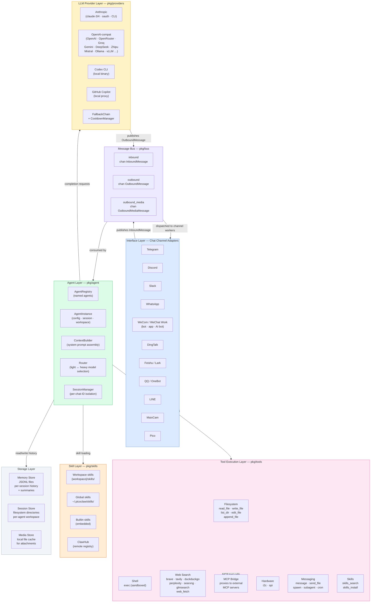
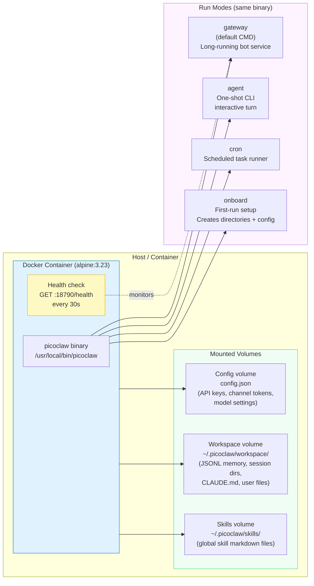

# Architecture Overview — Layered Diagram

Technology layers from the user interface down to storage, and a deployment diagram.

---

## Layered Architecture

```mermaid
graph TD
  subgraph L1["Interface Layer — Chat Channel Adapters"]
    direction LR
    TG["Telegram"]
    DC["Discord"]
    SL["Slack"]
    WA["WhatsApp"]
    WC["WeCom / WeChat Work\n(bot · app · AI bot)"]
    DT["DingTalk"]
    FS["Feishu / Lark"]
    QQ["QQ / OneBot"]
    LN["LINE"]
    MX["MaixCam"]
    PC["Pico"]
  end

  subgraph L2["Message Bus — pkg/bus"]
    direction LR
    IB["inbound\nchan InboundMessage"]
    OB["outbound\nchan OutboundMessage"]
    OM["outbound_media\nchan OutboundMediaMessage"]
  end

  subgraph L3["Agent Layer — pkg/agent"]
    direction LR
    REG["AgentRegistry\n(named agents)"]
    INST["AgentInstance\n(config · session · workspace)"]
    CTX["ContextBuilder\n(system prompt assembly)"]
    ROUT["Router\n(light ↔ heavy model selection)"]
    SESS["SessionManager\n(per-chat-ID isolation)"]
  end

  subgraph L4["LLM Provider Layer — pkg/providers"]
    direction LR
    ANTH["Anthropic\n(claude-3/4 · oauth · CLI)"]
    OAIC["OpenAI-compat\n(OpenAI · OpenRouter · Groq\nGemini · DeepSeek · Zhipu\nMistral · Ollama · vLLM …)"]
    CODX["Codex CLI\n(local binary)"]
    CPLT["GitHub Copilot\n(local proxy)"]
    FB["FallbackChain\n+ CooldownManager"]
  end

  subgraph L5["Tool Execution Layer — pkg/tools"]
    direction LR
    FS_T["Filesystem\nread_file · write_file\nlist_dir · edit_file\nappend_file"]
    SH_T["Shell\nexec (sandboxed)"]
    WEB_T["Web Search\nbrave · tavily · duckduckgo\nperplexity · searxng · glmsearch\nweb_fetch"]
    MCP_T["MCP Bridge\nproxies to external\nMCP servers"]
    HW_T["Hardware\ni2c · spi"]
    MSG_T["Messaging\nmessage · send_file\nspawn · subagent · cron"]
    SK_T["Skills\nskills_search\nskills_install"]
  end

  subgraph L6["Skill Layer — pkg/skills"]
    direction LR
    WS_SK["Workspace skills\n{workspace}/skills/"]
    GL_SK["Global skills\n~/.picoclaw/skills/"]
    BI_SK["Builtin skills\n(embedded)"]
    CH_SK["ClawHub\n(remote registry)"]
  end

  subgraph L7["Storage Layer"]
    direction LR
    MEM["Memory Store\nJSONL files\nper-session history\n+ summaries"]
    SESS_DB["Session Store\nfilesystem directories\nper-agent workspace"]
    MEDIA["Media Store\nlocal file cache\nfor attachments"]
  end

  L1 -->|"publishes InboundMessage"| L2
  L2 -->|"consumed by"| L3
  L3 -->|"completion requests"| L4
  L3 -->|"tool calls"| L5
  L3 -->|"skill loading"| L6
  L3 -->|"read/write history"| L7
  L5 -->|"MCP tool calls"| MCP_T
  L4 -->|"publishes OutboundMessage"| L2
  L2 -->|"dispatched to channel workers"| L1

  style L1 fill:#dbeafe,stroke:#3b82f6
  style L2 fill:#ede9fe,stroke:#8b5cf6
  style L3 fill:#dcfce7,stroke:#22c55e
  style L4 fill:#fef3c7,stroke:#f59e0b
  style L5 fill:#fce7f3,stroke:#ec4899
  style L6 fill:#ffedd5,stroke:#f97316
  style L7 fill:#f1f5f9,stroke:#94a3b8
```

---

## Deployment Diagram

```mermaid
graph LR
  subgraph Host["Host / Container"]
    direction TB

    subgraph Docker["Docker Container (alpine:3.23)"]
      BIN["picoclaw binary\n/usr/local/bin/picoclaw"]
      HC["Health check\nGET :18790/health\nevery 30s"]
    end

    subgraph Volumes["Mounted Volumes"]
      CFG_VOL["Config volume\nconfig.json\n(API keys, channel tokens,\nmodel settings)"]
      WS_VOL["Workspace volume\n~/.picoclaw/workspace/\n(JSONL memory, session dirs,\nCLAUDE.md, user files)"]
      SK_VOL["Skills volume\n~/.picoclaw/skills/\n(global skill markdown files)"]
    end
  end

  subgraph Modes["Run Modes (same binary)"]
    GW["gateway\n(default CMD)\nLong-running bot service"]
    AG["agent\nOne-shot CLI\ninteractive turn"]
    CR["cron\nScheduled task runner"]
    OB_M["onboard\nFirst-run setup\nCreates directories + config"]
  end

  BIN --> GW
  BIN --> AG
  BIN --> CR
  BIN --> OB_M

  Docker --> CFG_VOL
  Docker --> WS_VOL
  Docker --> SK_VOL

  HC -.->|"monitors"| GW

  style Docker   fill:#e0f2fe,stroke:#0284c7
  style Volumes  fill:#f0fdf4,stroke:#4ade80
  style Modes    fill:#fdf4ff,stroke:#c084fc
  style HC       fill:#fef9c3,stroke:#eab308
```
