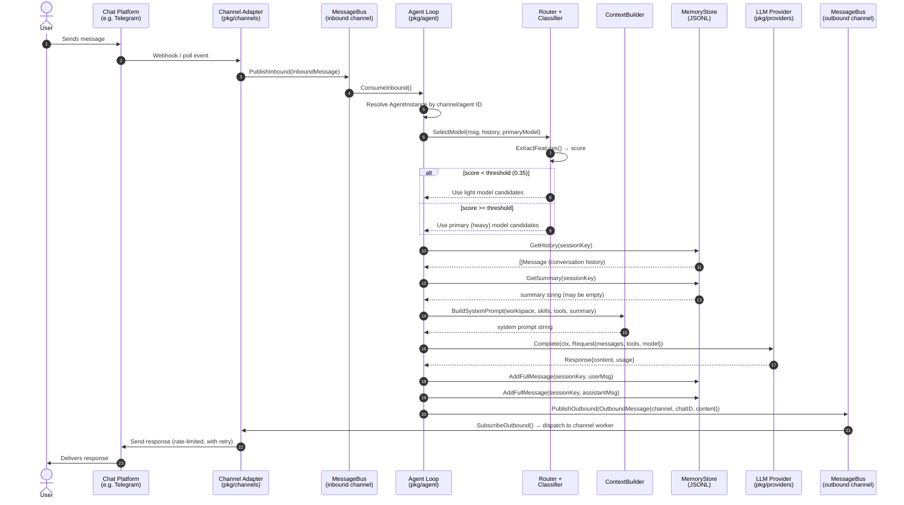
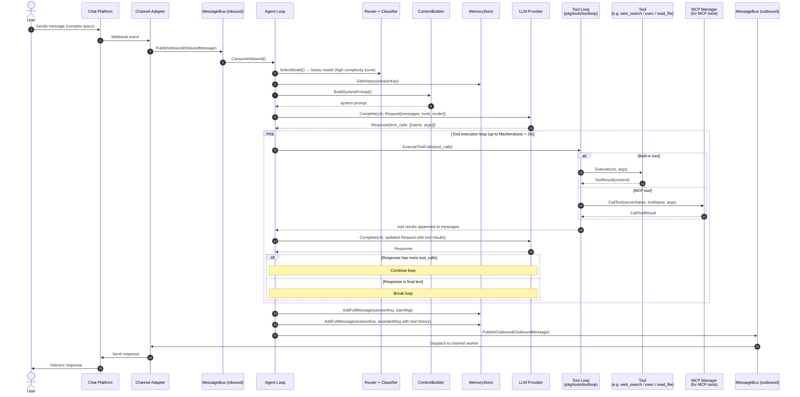
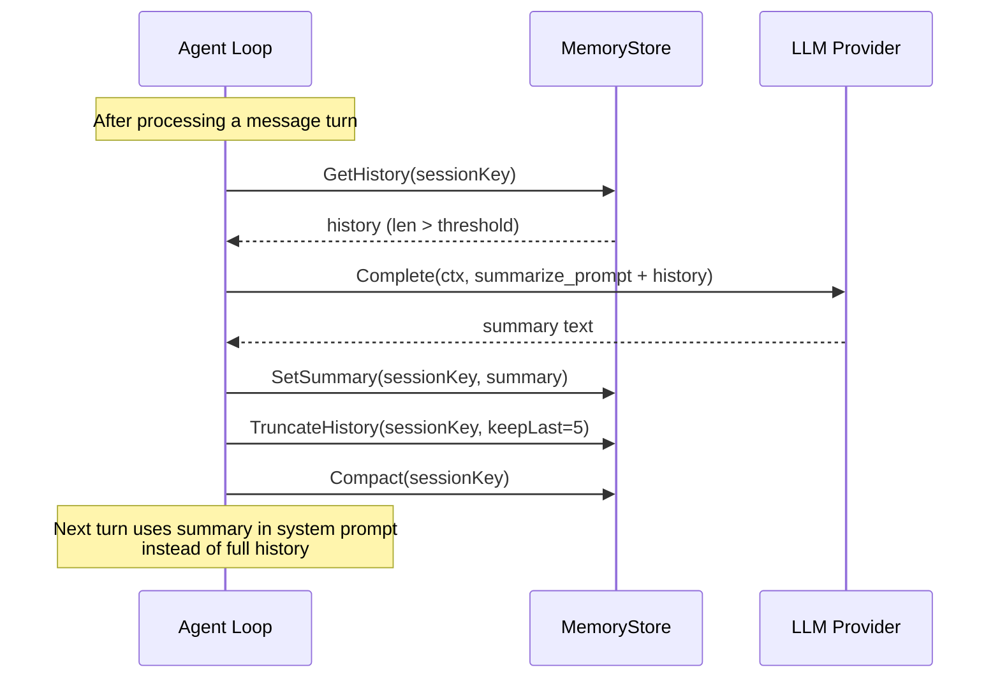
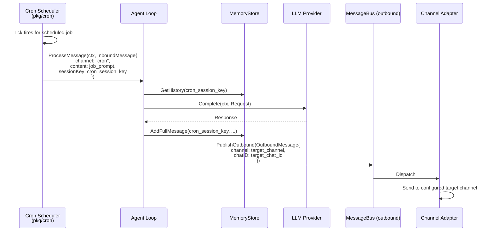

# Message Flow — Sequence Diagrams

End-to-end lifecycle of a single user message. Two scenarios are shown.

---

## Scenario 1 — Simple Message (no tool calls)

---

## Scenario 2 — Tool-Calling Message

---

## Optional Path A — Summarization Trigger

Fires when message count exceeds `SummarizeMessageThreshold` (default 20) or token usage
exceeds `SummarizeTokenPercent` (default 75%) of the context window.

---

## Optional Path B — Cron-Triggered Agent Invocation

